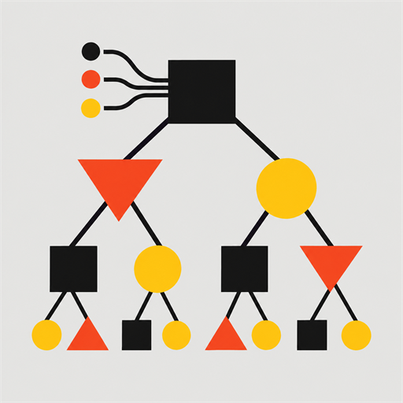

<p align="center">
  
</p>

# Machine Learning Algorithms

[](https://github.com/DiogoRibeiro7/Machine-Learning-Algorithms/actions/workflows/ci.yml)
[](https://github.com/DiogoRibeiro7/Machine-Learning-Algorithms/actions/workflows/docs.yml)
[](https://www.python.org/)
[](LICENSE)

Classical machine-learning algorithms implemented from first principles with NumPy.

The repository is built around a simple idea: keep the mathematics visible. Each maintained estimator has a small API, explicit numerical choices, typed Python code, unit and edge-case tests, mathematical documentation, and a compact reproducible example.

**Documentation:** https://diogoribeiro7.github.io/Machine-Learning-Algorithms/

## Why this repository exists

This is not intended to replace production libraries such as scikit-learn. It is an educational and technical reference for understanding how common algorithms move from a mathematical formulation to a working implementation.

The project favors:

- mathematically explicit implementations;
- NumPy as the only runtime dependency;
- deterministic behavior where algorithms contain ambiguity;
- documented numerical trade-offs;
- small estimator interfaces;
- tests for both ordinary and degenerate cases;
- notebooks that consume the package rather than hide implementation logic.

## Maintained algorithms

| Area | Estimator | Main numerical idea |
| --- | --- | --- |
| Regression | `LinearRegression` | Ordinary least squares via `numpy.linalg.lstsq` |
| Classification | `LogisticRegression` | Newton updates with stable logistic loss |
| Classification | `KNeighborsClassifier` | Brute-force Euclidean neighbour search |
| Classification | `GaussianNB` | Gaussian log-likelihoods with variance smoothing |
| Clustering | `KMeans` | Lloyd iterations with k-means++ or random initialization |
| Decomposition | `PCA` | Centered compact singular value decomposition |
| Classification | `LinearSVM` | Binary squared-hinge soft-margin optimization |

Each algorithm has a dedicated mathematical note under [the documentation site](https://diogoribeiro7.github.io/Machine-Learning-Algorithms/algorithms/).

## Quick start

The project targets Python 3.12+.

```bash
git clone https://github.com/DiogoRibeiro7/Machine-Learning-Algorithms.git
cd Machine-Learning-Algorithms
poetry install
```

A minimal example:

```python
import numpy as np

from ml_algorithms import LinearRegression

X = np.array([[0.0], [1.0], [2.0], [3.0]])
y = np.array([1.0, 3.0, 5.0, 7.0])

model = LinearRegression().fit(X, y)

print(model.coef_)
print(model.intercept_)
print(model.predict([[4.0]]))
```

The same estimator conventions are used throughout the package: `fit` returns `self`, fitted feature counts are tracked, and inference before fitting raises `NotFittedError`.

## Repository structure

```text
.
├── src/ml_algorithms/          # maintained implementations
├── tests/                      # unit and numerical edge-case tests
├── docs/                       # MkDocs Material documentation
├── notebooks/
│   ├── examples/               # maintained package examples
│   └── legacy/                 # historical notebooks
├── CONTRIBUTING.md
├── ROADMAP.md
├── mkdocs.yml
└── pyproject.toml
```

### Maintained package

The canonical implementations live in `src/ml_algorithms/`. Shared estimator contracts, validation helpers, fitted-state checks, and deterministic random-state handling are kept deliberately small.

### Examples

Maintained notebooks live in `notebooks/examples/` and import the package directly.

### Legacy material

The original notebooks are preserved under `notebooks/legacy/` for provenance. They are not the maintained implementation surface and are not expected to follow the current package, typing, testing, or dependency standards.

Some historical notebooks, including time-series forecasting and deep-learning material, are retained explicitly as out-of-scope material rather than being mixed into the modern library.

## Development

The quality stack is intentionally small:

```bash
poetry run ruff check src tests
poetry run ruff format --check src tests
poetry run mypy src tests
poetry run pytest
poetry run mkdocs build --strict
```

CI runs tests on Python 3.12, 3.13, and 3.14.

See [CONTRIBUTING.md](CONTRIBUTING.md) for the development workflow and expectations for new algorithm implementations. Release history is tracked in [CHANGELOG.md](CHANGELOG.md).

## Documentation

The MkDocs Material site includes:

- getting started;
- mathematical notes for every maintained algorithm;
- numerical implementation choices;
- architecture and estimator contracts;
- API reference generated from the package;
- maintained notebook examples;
- contribution and quality guides;
- the current project roadmap.

Build it locally with:

```bash
poetry run mkdocs serve
```

## Project status

The first modernization milestone is complete:

- repository foundation and tooling;
- seven maintained core algorithms;
- typed estimator contracts;
- tests across supported Python versions;
- mathematical documentation and examples;
- MkDocs Material documentation;
- GitHub Pages deployment.

The next work is tracked in [ROADMAP.md](ROADMAP.md), including numerical foundations, broader quality testing, benchmarking, and the first modern release.

## License

This project is licensed under the [GNU General Public License v3.0](LICENSE).
