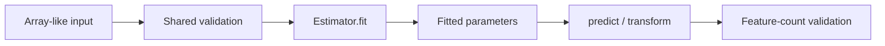

# Architecture

## Repository layout

```text
.
├── src/ml_algorithms/          # maintained package
├── tests/                      # unit and numerical edge-case tests
├── docs/                       # MkDocs source
├── notebooks/
│   ├── examples/               # maintained package examples
│   └── legacy/                 # historical notebooks
├── pyproject.toml
└── ROADMAP.md
```

## Estimator contract

The package keeps a deliberately small internal estimator protocol.



`BaseEstimator` provides fitted-state tracking and inference-time feature validation. `PredictorMixin` and `TransformerMixin` define the small behavioral surfaces used by concrete estimators.

This is intentionally smaller than scikit-learn's estimator protocol. The repository is educational: abstraction should remove repetition without obscuring the numerical method.

## Shared infrastructure

### Validation

`_validation.py` normalizes numeric feature matrices, rejects malformed or non-finite input, and checks supervised sample counts.

### Random state

`_random.py` accepts an integer seed, an existing NumPy `Generator`, or `None`. Integer seeds create reproducible independent generators.

### Error state

Calling an inference method before fitting raises `NotFittedError`.

### Optimization

`optimization.py` contains small reusable numerical primitives. These utilities expose iteration diagnostics explicitly and stay separate from estimator abstractions so the underlying update rules remain visible.

### Linear algebra

`linalg.py` centralizes only repeated numerical contracts: least-squares solves with diagnostics, pairwise Euclidean distances, and deterministic sign orientation for decomposition vectors. Algorithm-specific matrix constructions remain in their estimators.

## Algorithm modules

| Module | Main estimator |
| --- | --- |
| `linear_model.py` | `LinearRegression`, `LogisticRegression` |
| `neighbors.py` | `KNeighborsClassifier` |
| `naive_bayes.py` | `GaussianNB` |
| `cluster.py` | `KMeans` |
| `decomposition.py` | `PCA` |
| `svm.py` | `LinearSVM` |

## Notebooks are consumers

Maintained notebooks import the package and demonstrate it. They are not the canonical implementation and are not used as a substitute for unit tests.

The original notebooks are retained under `notebooks/legacy/` for provenance, including material now considered out of scope.
